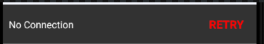

# react-native-network-toast
A native looking toast for Android. (Not sure about Ios as I dont have a MAC)

To Download, run:

    yarn add react-native-network-toast
    // or
    npm install -s react-native-network-toast.

Since react native >0.59 netinfo has been deprecated, so if you haven't please run:

    yarn add @react-native-community/netinfo
    // or
    npm install --save @react-native-community/netinfo

Add the following line for permission to AndroidManifest.xml: 
    
    android:name="android.permission.ACCESS_NETWORK_STATE"

You then need to link the native parts of the library for the platforms you are using. The easiest way to link the library is using the CLI tool by running this command from the root of your project:

    //then run
    react-native link @react-native-community/netinfo

To know more about netinfo click [`here`](https://github.com/react-native-community/react-native-netinfo)

Usage example: 

    //import HOC from react-native-network-toast
    import { withNetwork } from "react-native-network-toast";

    class YourComponent extends Component {
        componentDidMount() {
            // configure the retry button to execute your own
            const { setupNetworkRetry } = this.props;
            setupNetworkRetry(() => {
                console.warn("retry fetching data");
            });
        }

        render() {
            const { connected } = this.props; // get connection status from props
            return (
                <View>
                    {connected} ? <Text>Im connected</Text> : <Text>Im not connected</Text> 
                </View>
            );
        }
    }

    export default withNetwork()(YourComponent);
                           
Android Screenshot:

You can also configure the toast message style:

    export default withNetwork({
        buttonText: "fetch",
        buttonStyles: {
            backgroundColor: "white"
        },
        buttonTextStyles: {
            color: "green"
        },
        containerStyles: {
            backgroundColor: "red"
        },
        messageStyles: {
            color: "yellow"
        },
        messageText: "Failed",
        position: "top",
        positionOffset: 50
    })(C);

Android Screenshot:

##API Help

adding function to setupNetworkRetry.

| Arguments | Explanation | defaults |
| --- | --- | --- |
| functions | takes in a function only | void |

configuring withNetwork(arguments).

| Arguments        | Explanation | defaults       |
| -------------    | ----------- | -------------  |
| `buttonText` | text for retry button | Retry          |
| `buttonStyles` | styles for button container | default styles |
| `buttonTextStyles` | styles for button text | default styles |
| `containerStyles` | styles for toast container | default styles |
| `messageStyles` | styles for toast message | default styles |
| `messageText` | text for toast message | No Connection  |
| `position` | postion of toast message | bottom |
| `positionOffset` | how much should toast offset | 0 for bottom 30 for top |

